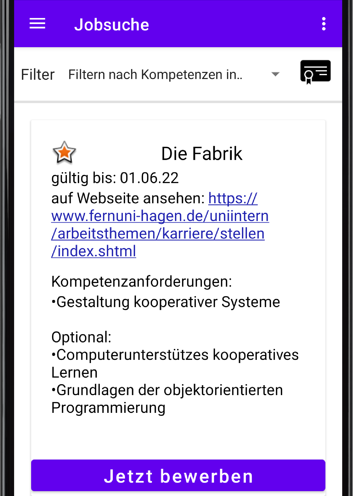
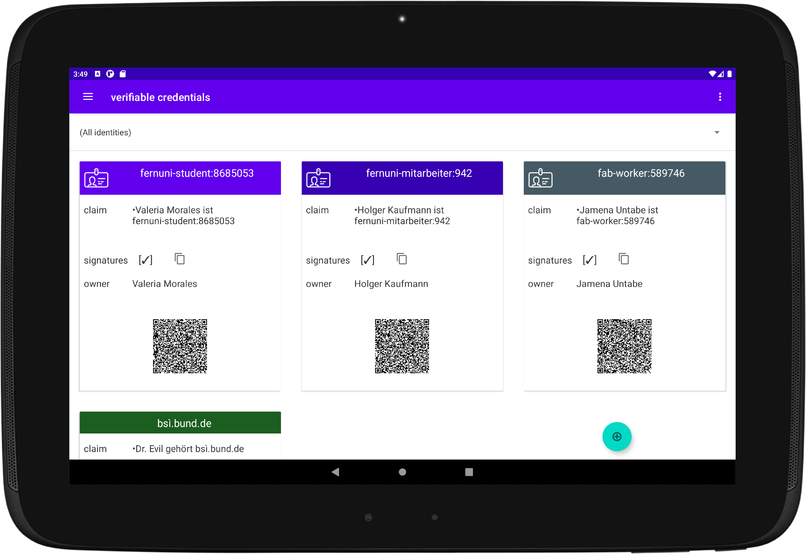
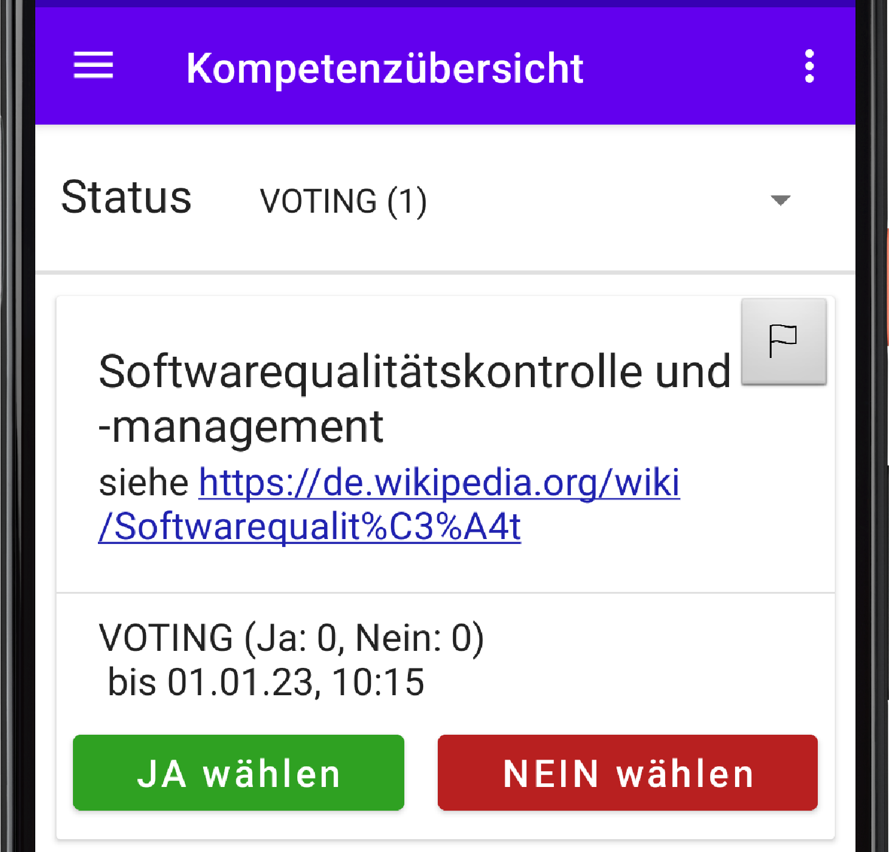

# Self-Sovereign Identities zum Nachweis von Kompetenzen

Kompetenznachweise sind eine essentielle Voraussetzung für die Zusammenarbeit in einer zunehmend wissensbasierten und arbeitsteiligen Wirtschaft. Digitale Nachweise, wie sie mit Self-Sovereign-Identities (SSI) möglich werden, können die Arbeit mit Kompetenznachweisen erleichtern, indem sie deren Nutzung in kooperativen Online-Systemen ermöglichen und die Verlässlichkeit erhöhen. Für eine Hausarbeit an der Fernuniversität Hagen wurde das Design von SSI zum Nachweis von Kompetenzen untersucht. Hierfür wurden zunächst Anforderungen für zwei demonstrative Apps zu diesem Thema aus einer Literaturrecherche abgeleitet. Darauf basierend wurden Spezifikationen und Implementierungen der Apps entwickelt. Im Design wurden verschiedene Konzepte aus dem zugehörigen Kurs der Fernuniversität Hagen genutzt, beispielsweise Entwurfsmuster, Datensparsamkeit, multiple Rollen, Benutzerfreundlichkeit und informationelle Selbstbestimmung.

Dieses Repository enthält den Code der zwei Android Apps. Die SSIWalletDemo App basiert auf dem Vorhaben zur EU-ID-Wallet. Die Competence Manager App dient als Anwendungsbeispiel für die Arbeit mit SSI-Nachweisen.

Kompetenzmanager              |  SSI-Wallet
:-------------------------:|:-------------------------:
  |  

## Wie werden neue Kompetenzprofile eingeführt?
In der Kompetenzmanager-App können keine neuen Kompetenzprofile angelegt werden. Ein System zur Einführung könnte wie folgt aussehen: 

Auf der Webseite der Community kann jeder Benutzer neue Kompetenzprofile erstellen. Diese befinden sich zunächst im Zustand SUGGESTION und können nicht für die Nachweisführung genutzt werden. Jedes Mitglied kann den neuen Vorschlag liken, um sein Interesse daran zu bekunden. Wird ein gewisses Quorum, z.B. 10 Likes, erreicht, so geht das Profil in den Status VOTING über.

### Voting
Beim Voting dürfen alle Mitglieder der Gemeinschaft über die Einfürhrung neuer Kompetenzen abstimmen. Innerhalb eines bestimmten Zeitraums, z.B. 14 Tage, kann ein authentifiziertes Mitglied jeweils eine Stimme abgeben, was auch über die App möglich ist. Erhält der Vorschlag nach Zeitablaug mehr JA als NEIN-Stimmen, so wird er angenommen und das neue Kompetenzprofil ist für die Nachweisführung nutzbar. Es geht dabei in den Zustand ACCEPTED über.

### Arbitration Committee 
Das Arbitration Committee ist ein gewähltes Gremium der Community, das über Konflikte zwischen Benutzern entscheidet. Es fungiert als letzte Instanz in Konflikten, kann Benutzer sperren, Sachverhalte feststellen und Handlungsvorgaben setzen. Kompetenzprofile können in der App an ein Moderationsteam gemeldet werden, welches bei strittigen Fragen an das Committee delegiert. Kompetenzprofile sind dort im Zustand ARBITRATION bis über die entschieden wurde. Während dessen können keine neuen Nachweise erstellt werden, bestehende bleiben jedoch gültig.
